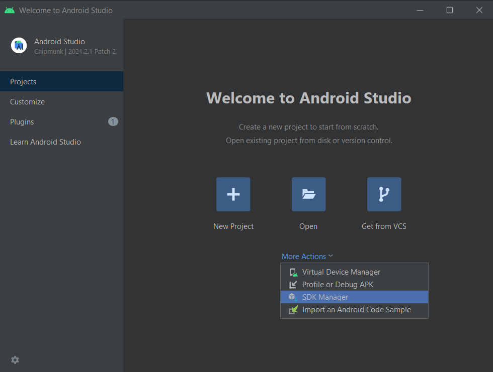
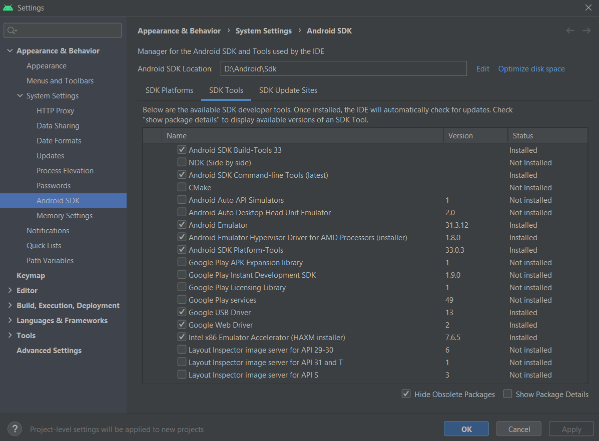
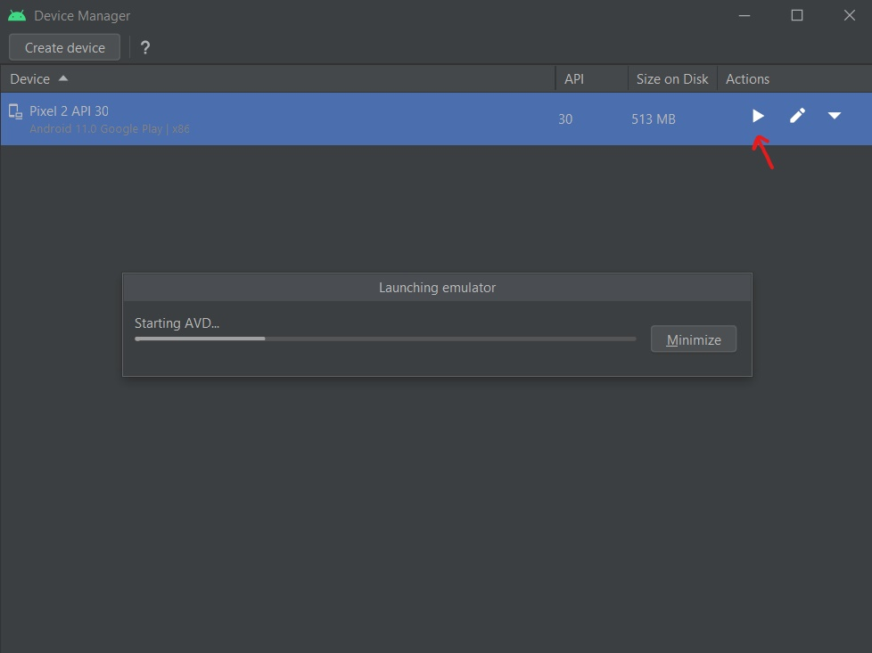
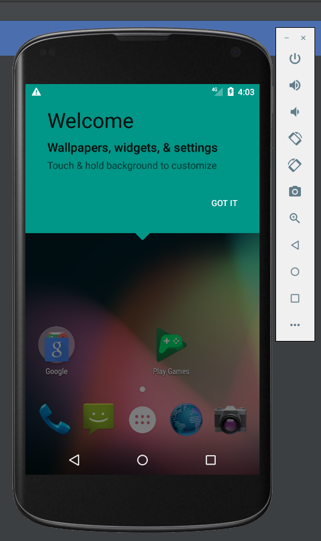
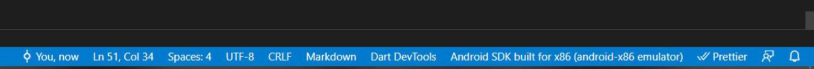
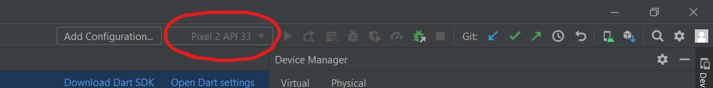
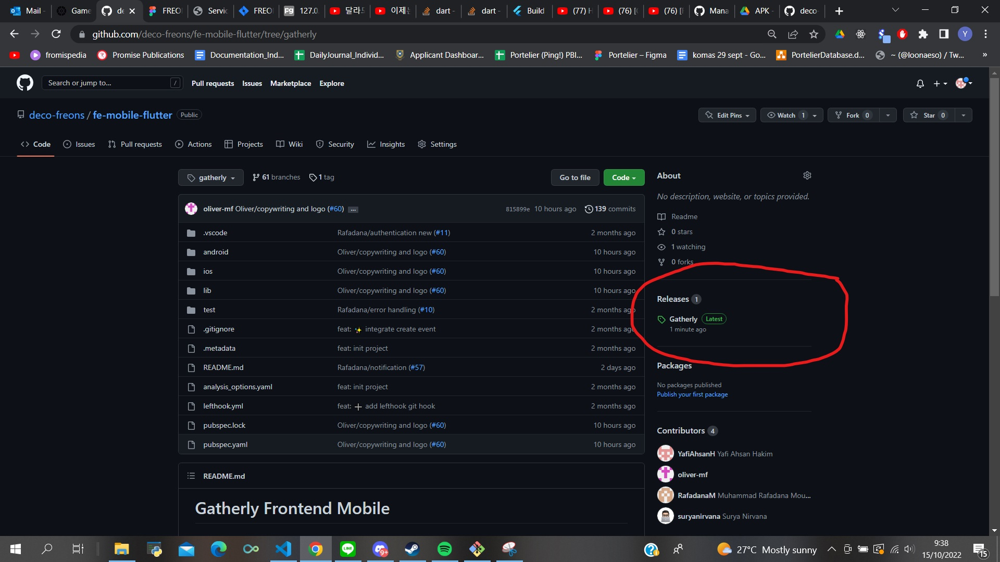
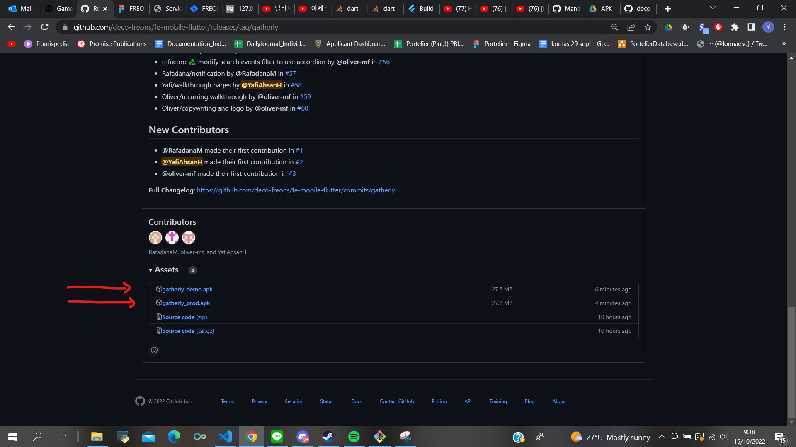

# Gatherly Frontend Mobile


## About Gatherly

Gatherly is a mobile based application, which helps socially isolated young people to join events and socialise. Gatherly shows events around the user based on their interests and the user can swipe left or right on the events to either skip or join the events. They can also see the event details and the number of participants before joining an event to make sure they are comfortable when attending the events. Gatherly also provides search feature for people that wants to schedule events beforehand.

## Getting Started

### Prerequisites

Before installing the project, make sure you have Flutter installed by following this [guide](https://docs.flutter.dev/get-started/install) provided by the flutter team.

### Installation

1. Clone the repo
   ```sh
   git clone https://github.com/deco-freons/fe-mobile-flutter.git
   ```
2. Install package dependencies in `pubspec.yaml`
   ```bash
   flutter pub get
   ```
3. Create `.env` file and write
   ```sh
   googleApiKey='YOUR_GOOGLE_API_KEY'
   releaseEnv='dev' or 'prod' or 'demo'
   ```

### Running the Project

- Android Device
  - Enable [Developer options](https://developer.android.com/studio/debug/dev-options)
  - Enable `USB Debugging` in Developer options
  - Plug your device to a computer with a USB cable and allow `USB debugging` if asked
  - Run the project
    ```sh
    flutter pub run lib/main.dart
    ```
- Android Emulator
  - Download Android Studio from this [link](https://developer.android.com/studio)
  - Open your Android Studio
  - Go to your SDK manager by clicking **More Actions > SDK Manager**
    
  - Navigate to SDK Tools tab and make sure that these tools are installed:
    - Android SDK Command Line Tools
    - Android Emulator
    - Android SDK Platform Tools
      
  - Go to your virtual device manager by clicking **More Actions > Virtual Device Manager**
  - Click **Create device**
  - Choose your device model and system image then click **Finish**
  - Run your newly created virtual device by clicking the play button (make sure you have enough disk space to run the emulator)
    
    
  - Once the emulator is running, make sure your virtual device is connected to your IDE
    - if you're using VScode this is what it looks like when you're connected
      
    - if you're using Android Studio this is what it looks like when you're connected
      
  - Run the project from your terminal
    ```sh
    flutter pub run lib/main.dart
    ```

### Building and Downloading the APK

- Building the APK

  - Set the build name by changing 'version' variable in the `pubspec.yaml`

    ```sh
    version: "YOUR_BUILD_NAME"+1
    ```

    - example:
      ```sh
      version: 1.0.0+1
      ```

  - Build the APK by running this code in the terminal
    ```sh
    flutter build apk
    ```

- Downloading the APK

  You can download the Gatherly APK from these links:

  - [Gatherly demo](https://drive.google.com/file/d/1CNGG5g4IMPL2XqtYzudARilljgZOpUSv/view?usp=sharing)
  - [Gatherly production](https://drive.google.com/file/d/1uvEo0zhap_42r1TBjCd3dFaSK0LRCdff/view?usp=sharing)

  Alternatively you can access the APK from the release section

  - Click the latest release in the github page
    
  - you can find the APKs for the gatherly at the bottom of the page
    

  Once you've downloaded the APK, run the apk in your phone to install the app
